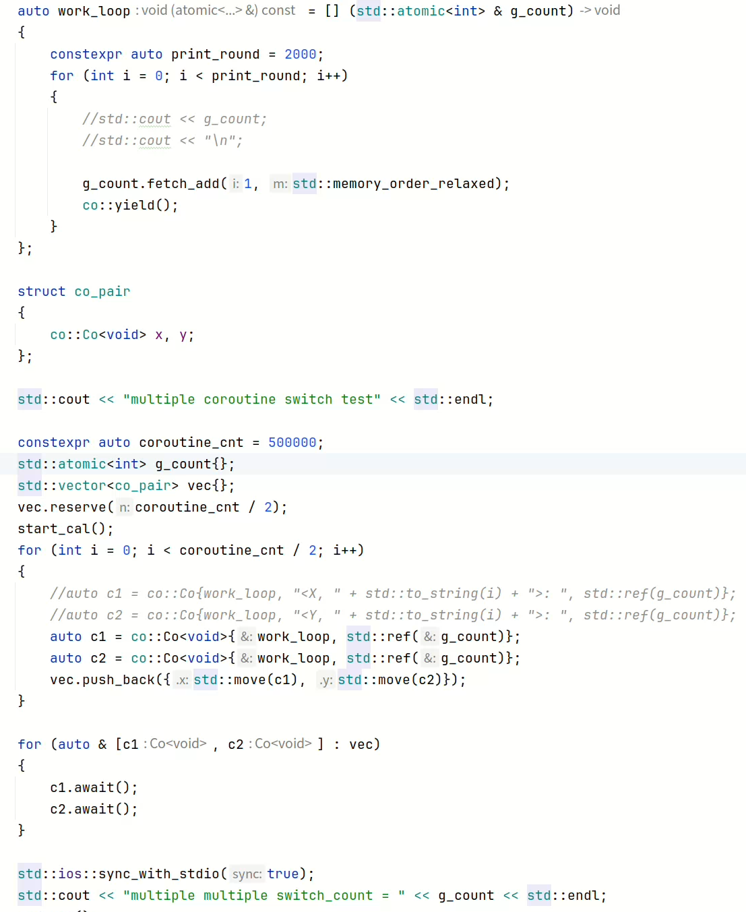
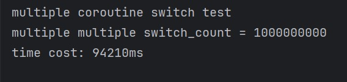
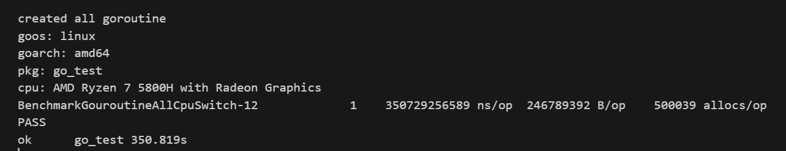

<h1>CatCoroutine</h1>

**CatCoroutine**是一个基于C++17编写的**有栈协程库** 
性能测试: 
&emsp;测试平台和编译器：Ubuntu/Gcc13.1 
&emsp;测试代码（启动50W个协程序，共切换10亿次）： 
 
&emsp;测试结果： 
&emsp;&emsp;**CatCoroutine** 
&emsp;&emsp; 
&emsp;&emsp;**GoLang** 
&emsp;&emsp; 